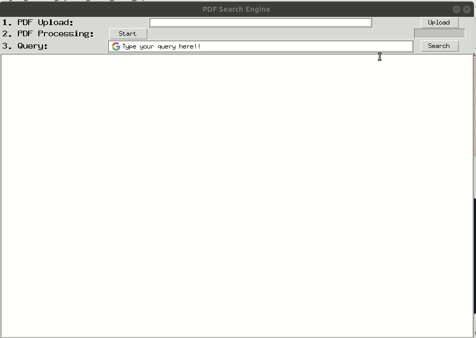

# PDF-Search-Engine
The project is inspired by sciencedirect.com where it can retrieve the relevant chapter from curated journal papers to match our query. This script will do the same for PDF except that it's not curated list of PDFs as it operates for a single PDF. It will retrieve relevant PDF's page of the choosen PDF file. 

## Pipeline
First, it will strip-off all the PDF pages into a single page. This single page will be treated as a single document so that it can be processed with Vector Relation. Then it will use textract package to extract all texts in a single PDF page. After the query being given by the user (query can be more than 2 words), it will return the summary. You can read the summary in terminal or at your home file with the name file: summary_{your query}.txt.

## Required Packages:
- textract
- PyPDF2
- pdftk on Ubuntu

## How to Use?
1. Type python search_engine.py
2. Enter your PDF file path
3. Enter your query. Note that the query can be more than two words
4. To exit, press CTRL+C

